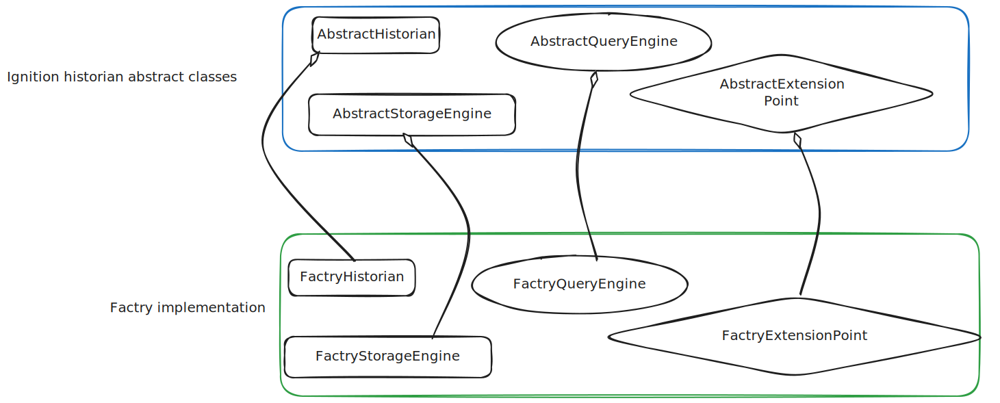
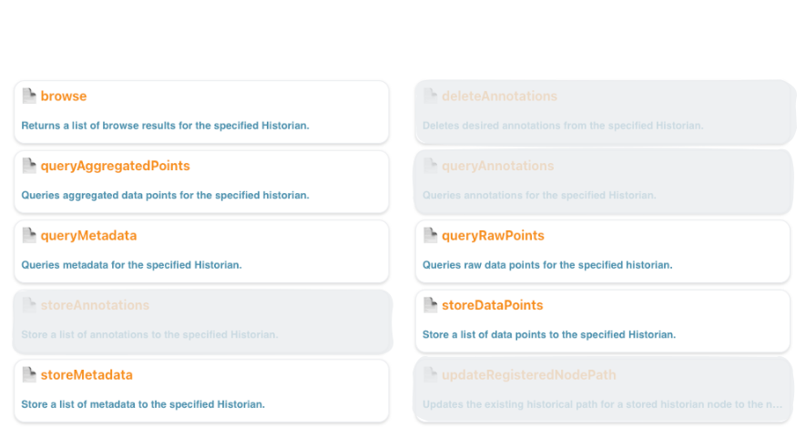
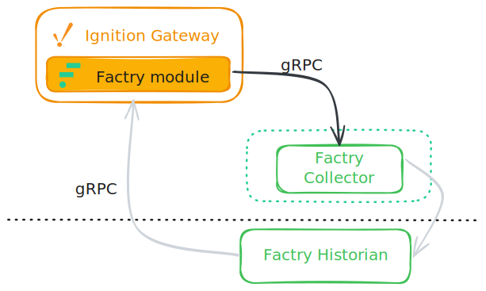
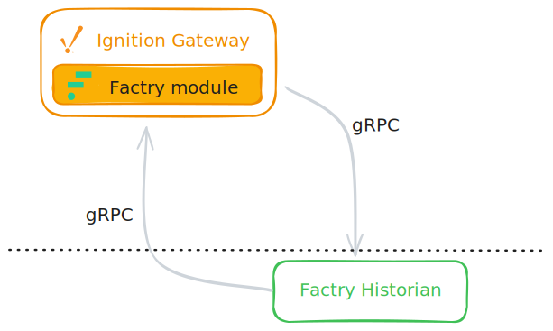

<div class="cover-page">
  <div class="cover-center">
    
    <h1 class="cover-title">Factry Historian Module<br/>Research & Specification</h1>
  </div>
</div>

<div class="toc-page">

## Content

 - Executive Summary
 - Introduction
 - Ignition Platform
 - What is a Historian Module in Ignition?
 - Building the Module for Factry
 - Summary of Required Features
 - Proposed Milestones and Estimations
 - Appendix

</div>

# Executive Summary

This document presents research findings and a technical specification for building a custom historian module that integrates Factry Historian with the Ignition industrial automation platform.

**Key Findings:**

- Ignition 8.3 provides a Historian SDK that enables third-party historian integration
- A Factry module would allow Ignition users to store tag data in Factry Historian and retrieve historical data for trending and analysis
- The module consists of two main components: a **Collector** (for writing data) and a **Provider** (for reading data)

**Key Decision Required:**

Factry must decide on the collector architecture:
- **Option A:** Leverage the existing Factry Collector as an intermediary, benefiting from its store-and-forward capabilities and centralized management
- **Option B:** Build collector functionality directly into the Ignition module, reducing deployment complexity for customers

**Effort Estimate:**

We estimate this project will require **30-40 programming days** plus **3 days of project management**.

**Additional Value:**

The historian provider will enable Ignition to discover and query data in Factry that was not ingested by Ignition. This means customers who create asset structures directly in Factry can use that data in Ignition dashboards and trends.

# Introduction

This document presents research conducted over five days into the Ignition 8.3 Historian API, with the goal of defining what it will take to build a custom historian module for Factry Historian integration.

The purpose of this specification is to provide Factry with:
- A clear understanding of the technical requirements
- Architectural decisions that need to be made
- An estimate of the development effort required
- A roadmap for implementation

## Ignition Platform
Ignition is an industrial automation platform for SCADA, IIoT, MES, and more from Inductive Automation. Version 8.3, released in August 2024, is the latest major release. Ignition is written in Java and Kotlin, with version 8.3 written in Java 17. The platform provides a module SDK that allows users to extend its functionality with custom modules. Gradle is the recommended build tool and package manager.

Ignition documentation is auto-generated from JavaDoc, but Kotlin components are not fully documented. Combined with limited examples for the new 8.3 APIs, this creates challenges for module development. The official Inductive Automation forum provides active support from experts to fill these gaps.

# What is a Historian Module in Ignition?

## Overview

A common misconception about Ignition is that it functions as a historian on its own. This isn’t the case. Ignition does not store historical data internally, instead, it relies on external databases or third-party historians for both storing and retrieving data. Because of this flexibility and broad compatibility, many historians such as Canary Labs or TimeBase also provide Ignition modules that integrate seamlessly with the platform.

A historian module in Ignition has two primary responsibilities:
1. **Storing data** - Receiving tag values from Ignition and forwarding them to the external historian
2. **Retrieving data** - Querying historical data from the external historian and returning it to Ignition for visualization

The Ignition module SDK contains the Historian API for third-party historian integration. This API allows developers to create custom modules that connect Ignition to external historian systems like Factry Historian.

## Storing Data to the Historian

Tags are named data points that represent real-time values from industrial sources (PLCs, sensors, OPC servers) or calculated values, serving as the fundamental abstraction for accessing, storing, and scripting against process data throughout the Ignition platform.

The Tag Browser displays all tags organized by tag provider:


Beyond a simple 'value', each tag has additional properties:
- **Metadata**: Engineering units, format string, documentation
- **Quality**: Connection status, staleness indicators
- **History**: Configuration for historical data storage

The History property is where a custom historian connects to a tag. All tag properties can be configured in the Tag Editor, including assigning a historian as the history provider:


**How data storage works:** When a tag provider updates a tag value, the historian module's storage engine is invoked. The module must then forward the new data point to the external historian system (in this case, Factry Historian).

The following diagram illustrates the data flow:


## Retrieving Data from the Historian

**How data retrieval works:** When a tag is added to a chart, trend, or queried via script, the historian module's query engine is invoked. The module must construct an appropriate query for the external historian, send the request, and return the retrieved data to Ignition for visualization.

This enables:
- Historical trends and charts in Ignition
- Scripted queries for custom analysis
- Report generation with historical data

## Technical: Historian SDK

Version 8.3 introduced a major refactoring of the Historian API. While the core changes are complete,  examples are still limited. The public API is primarily contained in two packages:
  - `com.inductiveautomation.historian.gateway.api`
  - `com.inductiveautomation.historian.common.model`

Ignition modules use OOP concepts: implementation of a new historian connection requires inheriting from and overriding abstract base classes.




### API Structure

Here is an overview of the key API elements that would need to be implemented:

```
com.inductiveautomation.historian.gateway.api
├── Historian<S>                    - Main historian interface
├── AbstractHistorian<S>            - Base implementation class
├── HistorianManager                - System historian manager
├── config/
│   └── HistorianSettings          - Configuration marker interface
├── query/
│   ├── QueryEngine                - Data retrieval interface
│   ├── AbstractQueryEngine        - Base query implementation
│   ├── browsing/
│   │   └── BrowsePublisher        - Tag browsing API
│   └── processor/
│       ├── RawPointProcessor      - Raw data processing
│       ├── AggregatedPointProcessor - Aggregated data processing
│       └── ComplexPointProcessor  - Complex data processing
├── storage/
│   ├── StorageEngine              - Data storage interface
│   └── AbstractStorageEngine      - Base storage implementation
└── paths/
    └── QualifiedPathAdapter       - Path normalization
```

### Module Folder Structure

Ignition defines scopes that constrain where parts of a module may execute. The module would use the GCD scopes, meaning shared code is available in all three scopes:
- **G** (Gateway): Server-side code running on the Ignition Gateway
- **C** (Client): Code for Vision Clients and Designer environment
- **D** (Designer): Designer-only functionality

<br/>

The module folder structure would partly reflect Ignition's GCD-scope architecture:

```
factry-historian-module/
├── common/              - Shared code (GCD scope: Gateway, Client, Designer)
│   └── src/            - Module constants and shared interfaces
├── gateway/            - Server-side historian logic (G scope: Gateway)
│   └── src/            - Storage Provider and History Provider implementations
├── client/             - Client runtime code (CD scope: Client, Designer)
│   └── src/            - Vision Client functionality
├── designer/           - Designer-specific code (D scope: Designer)
│   └── src/            - Designer tools and UI components
├── certificates/       - Module signing certificates (*.jks, *.p7b)
├── build/              - Gradle build output
│   └── Factry-Historian.modl  - Final signed module file
├── gradle/             - Gradle wrapper files
└── docs/               - Project documentation
```

## Ignition Python Functions

With proper implementation of the historian module, historian functionality becomes available from Ignition's Python scripting environment. This section documents the functions that the Ignition SDK supports.

### Available Functions



**1. browse** - Returns a list of browse results for the specified historian, allowing discovery of available historical tags.

**2. queryRawPoints** - Queries raw (unprocessed) data points for specified time ranges.

**3. queryAggregatedPoints** - Queries data points with aggregation functions (average, min, max, etc.) applied.

**4. queryMetadata** - Retrieves metadata about historical tags.

**5. storeDataPoints** - Stores data points to the historian (used for manual data injection or backfilling).

**6. storeMetadata** - Stores metadata for historical tags.

Detailed function signatures and examples are provided in the Appendix.

# Building the Module for Factry

This section describes the specific implementation decisions and scope for the Factry Historian module.

## Supported Functions

The Factry Historian module would implement 6 of the available historian functions as shown in the diagram above.

**Out of scope for this version:**
- Annotations (not currently supported by Factry)
- History renaming (not currently supported by Factry)

These limitations are based on Factry's current API capabilities, not Ignition's SDK. If Factry adds support for these features in the future, the module could be extended accordingly.

## Key Decision: Collector Architecture

There are two viable approaches for the data collection (storage) component. This is a strategic decision for Factry to make:


### Option A: Use Existing Factry Collector



In this mode, the Ignition module would send data to an existing Factry Collector, which then forwards it to Factry Historian.

**Advantages:**
- Less functionality needs to be built into the Ignition module
- Store-and-forward capability is already implemented in the Factry Collector
- Data buffering during network outages is handled by the Collector
- Factry has more control over collector updates and improvements
- Compression and local aggregation features may already exist

**Considerations:**
- Customers need to deploy and maintain both the Ignition module and Factry Collector
- Additional network hop in the data path

### Option B: Collector Built into Ignition Module



In this mode, the Ignition module would register itself as a collector in Factry and communicate directly with Factry Historian.

**Advantages:**
- One less component for customers to install and maintain
- One less point of failure in the data chain
- Simpler deployment architecture

**Considerations:**
- Store-and-forward functionality would need to be implemented in the module
- More development effort required
- Updates to collector functionality require Ignition module updates

**Recommendation:** We present both options for Factry to make an informed decision based on their product strategy. Both approaches are technically feasible.

## Historian Provider

The historian provider component must be built regardless of the collector architecture choice. This component handles all data retrieval from Factry Historian.

**Core functionality:**
- Query raw data points for specified time ranges
- Query aggregated data points with configurable aggregation functions
- Query tag metadata
- Browse available historical tags
- Support pagination for large result sets

**Main development effort:** The primary work involves translating Ignition's query format to Factry's query API and handling the response transformation.

**Additional capability:** The historian provider will enable Ignition to discover and query data in Factry that was not ingested by Ignition. For example, if customers create asset structures directly in Factry, that data becomes available in Ignition for trending and analysis - even if those tags don't exist in Ignition's tag structure.

## Communication Protocol

The module would communicate with Factry services using gRPC, a high-performance RPC framework designed for low-latency, high-throughput communication.

**Protocol Buffers (protobuf)** would define the message formats and service interfaces shared between Factry and the Ignition module. These definitions generate type-safe Java classes for:
- Data point transmission (timestamps, values, quality codes)
- Query requests and responses
- Configuration and metadata exchange

This approach ensures consistent serialization, backward compatibility, and efficient binary encoding for industrial data volumes.

## Optional: Extended Scripting Functions

Factry offers features beyond standard historian capabilities, such as **Events**. These could potentially be exposed in Ignition through custom system functions.

**Example potential addition:**
```python
system.factry.queryEvents(assetPath, startTime, endTime, eventTypes)
```

**Recommendation:** We suggest waiting for customer requests before implementing extended functions. This keeps the initial release focused on core historian functionality (MVP scope). Extended functions can be added in future releases based on actual customer demand.

# Summary of Required Features

The Factry Historian module requires the following components to be built:

## Collector (Storage Provider)

Responsible for writing data from Ignition to Factry Historian:

| Feature | Description |
|---------|-------------|
| Store data points | Forward tag values with timestamps and quality codes |
| Store metadata | Synchronize tag metadata changes |
| Connection handling | Manage connection failures and automatic reconnection |
| Mode support | Support either direct mode or collector proxy mode (based on architecture decision) |

## Provider (History Provider)

Responsible for reading historical data from Factry Historian:

| Feature | Description |
|---------|-------------|
| Raw queries | Query unprocessed data points for time ranges |
| Aggregated queries | Query with aggregation functions (avg, min, max, etc.) |
| Metadata queries | Retrieve tag metadata |
| Browse | Discover available historical tags in Factry |
| Pagination | Handle large result sets efficiently |

## Configuration

| Feature | Description |
|---------|-------------|
| Gateway config page | Connection settings UI in Ignition Gateway |
| Multiple instances | Support connecting to multiple Factry Historian instances |
| Tag history selection | Enable selection of Factry Historian in Tag Editor |

## Python Scripting

| Feature | Description |
|---------|-------------|
| 6 historian functions | browse, queryRawPoints, queryAggregatedPoints, queryMetadata, storeDataPoints, storeMetadata |

# Proposed Milestones and Estimations

## Development Milestones

### Milestone 1: Proof of Concept
Basic data flow demonstration: Ignition tag values are sent to Factry Historian.

**Deliverable:** Working prototype showing data transmission from Ignition to Factry.

### Milestone 2: Historian Collector
Full implementation of the storage/collector component as specified in this document.

**Deliverable:** Production-ready collector with all storage features, connection handling, and configuration UI.

### Milestone 3: Historian Provider
Full implementation of the query/provider component as specified in this document.

**Deliverable:** Production-ready provider with all query types, browsing, and pagination support.

### Milestone 4: Testing and Documentation
Integration testing, performance validation, and user documentation.

**Deliverable:** Tested module ready for deployment, with installation and configuration guides.

## Effort Estimation

| Category | Estimate |
|----------|----------|
| Programming | 30-40 days |
| Project Management | 3 days |
| **Total** | **33-43 days** |

This estimate assumes:
- One experienced Java/Ignition developer
- Access to Factry technical resources for API questions
- gRPC/protobuf definitions provided by Factry

# Appendix

## Python Function Reference

### browse

Returns a list of browse results for the specified historian.

**Syntax 1:**
```python
system.historian.browse(rootPath, browseFilter)
```

Parameters:
- `rootPath` (String): The root path to start browsing from.
- `browseFilter` (Dictionary[String, Any]): A dictionary of browse filter keys.

**Filter Keys:**
- `dataType`: Represents the data type on the tag.
- `valueSource`: Represents how the node derives its value.
- `tagType`: The type of the node (tag, folder, UDT instance, etc).
- `typeId`: Represents the UDT type of the node.
- `quality`: Represents the "Bad" and "Good" quality on the node.
- `maxResults`: Limits the amount of results returned.

**Syntax 2:**
```python
system.historian.browse(rootPath[, snapshotTime][, nameFilters][, maxSize][, recursive][, continuationPoint][, includeMetadata])
```

### queryRawPoints

Queries raw data points for the specified historian.

```python
system.historian.queryRawPoints(paths, startTime, endTime[, columnNames][, returnFormat][, returnSize], includeBounds[, excludeObservations])
```

**Example:**
```python
# Query a historical tag path and display raw data from the past minute
end = system.date.now()
start = system.date.addMinutes(end, -1)

myDataset = system.historian.queryRawPoints(
    ["[default]_Simulator_/Random/RandomInteger1"],
    start,
    end,
    includeBounds=False
)

for row in myDataset:
    print row[0], row[1]
```

### queryAggregatedPoints

Queries aggregated data points for the specified historian.

```python
system.historian.queryAggregatedPoints(paths, startTime, endTime[, aggregates][, fillModes][, columnNames][, returnFormat][, returnSize][, includeBounds][, excludeObservations])
```

### queryMetadata

Queries metadata for the specified historian.

```python
system.historian.queryMetadata(paths[, startDate][, endDate])
```

### storeDataPoints

Stores data points to the specified historian.

```python
system.historian.storeDataPoints(paths, values[, timestamps][, qualities])
```

**Example using DataPoint:**
```python
from com.inductiveautomation.historian.common.model import DataPoint

datapoint = DataPoint(
    "histprov:test:/sys:myGateway:/prov:default:/tag:me",
    42,
    system.date.now(),
    192
)

system.historian.storeDataPoints([datapoint])
```

### storeMetadata

Stores metadata for the specified historian.

```python
system.historian.storeMetadata(paths, timestamps, properties)
```

## Links

Ignition 8.3 documentation

  https://www.docs.inductiveautomation.com/docs/8.3/intro

System historian functions

  https://docs.inductiveautomation.com/docs/8.3/appendix/scripting-functions/system-historian

Custom historian forum

  https://forum.inductiveautomation.com/t/ignition-8-3-building-a-custom-tag-historian-module/100725
