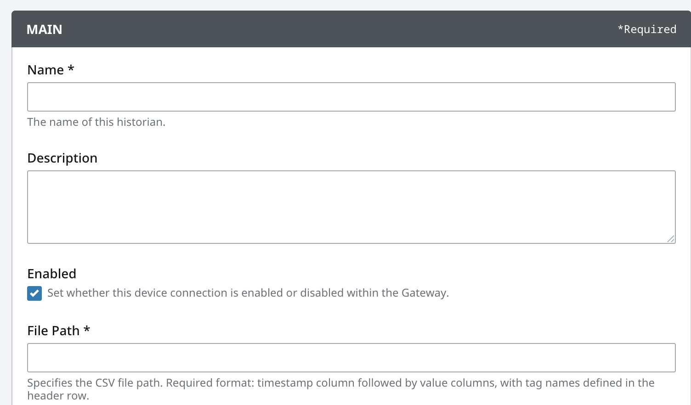

# Notes

1. Proxy architecture
2. gRPC 
    protobuf file

--> demo

1. test with Factry Collector 

2. Use token to create historian (Configure in Ignition Admin page)
   
    Filepath-> one token with everything
    

3. Tag-level settings for precision control

4. Automatic data storage to Factry Historian

5. Data retrieval and displaying
    test proxy as an example

6. Tag Browser, all tags listed, hiearchical 
      (Create tag provider explicit?)

7.  Tag details (e.g. metadata)

8.  tag path changes in ignition 
    
9.  Storage Allowed (store and forward)
   If false, the provider will only be used for querying historical data. If true, the provider will create a store and forward pipeline for sending data to a remote Gateway.

