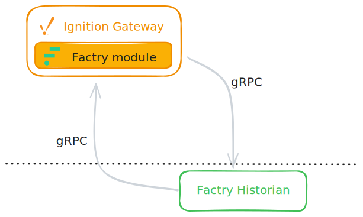

# Design Overview



## Ignition Platform

Ignition is an industrial automation platform for SCADA, IIoT, MES, and more from Inductive Automation. Version 8.3, released in August 2024, is the latest major release. Ignition is written in Java and Kotlin, with version 8.3 targeting Java 17. The platform provides a module SDK that allows developers to extend its functionality with custom modules, using Gradle as the build tool.

A common misconception about Ignition is that it functions as a historian on its own. This isn't the case — Ignition does not store historical data internally. Instead, it relies on external databases or third-party historians for both storing and retrieving data. This flexibility is why many historian vendors (such as Canary Labs or TimeBase) provide Ignition modules that integrate seamlessly with the platform.

## What is a Historian Module?

A historian module in Ignition has two primary responsibilities:

1. **Storing data** — Receiving tag values from Ignition and forwarding them to the external historian
2. **Retrieving data** — Querying historical data from the external historian and returning it to Ignition for visualization

The Ignition 8.3 module SDK contains the Historian API for third-party historian integration. This API allows developers to create custom modules that connect Ignition to external historian systems like Factry Historian.

## Storing Data to the Historian

Tags are named data points that represent real-time values from industrial sources (PLCs, sensors, OPC servers) or calculated values. They serve as the fundamental abstraction for accessing, storing, and scripting against process data throughout the Ignition platform.

Beyond a simple value, each tag has additional properties:
- **Metadata**: Engineering units, format string, documentation
- **Quality**: Connection status, staleness indicators
- **History**: Configuration for historical data storage

The History property is where a custom historian connects to a tag. When a tag provider updates a tag value, the historian module's storage engine is invoked and forwards the new data point to the external historian system (in this case, Factry Historian).

## Retrieving Data from the Historian

When a tag is added to a chart, trend, or queried via script, the historian module's query engine is invoked. The module constructs an appropriate query for the external historian, sends the request, and returns the retrieved data to Ignition for visualization.

This enables:
- Historical trends and charts in Ignition
- Scripted queries for custom analysis
- Report generation with historical data

## Historian SDK

Version 8.3 introduced a major refactoring of the Historian API. The public API is primarily contained in two packages:
- `com.inductiveautomation.historian.gateway.api`
- `com.inductiveautomation.historian.common.model`

Implementation of a new historian requires inheriting from and overriding abstract base classes. Here is an overview of the key API elements:

```
com.inductiveautomation.historian.gateway.api
├── Historian<S>                    - Main historian interface
├── AbstractHistorian<S>            - Base implementation class
├── HistorianManager                - System historian manager
├── config/
│   └── HistorianSettings          - Configuration marker interface
├── query/
│   ├── QueryEngine                - Data retrieval interface
│   ├── AbstractQueryEngine        - Base query implementation
│   ├── browsing/
│   │   └── BrowsePublisher        - Tag browsing API
│   └── processor/
│       ├── RawPointProcessor      - Raw data processing
│       ├── AggregatedPointProcessor - Aggregated data processing
│       └── ComplexPointProcessor  - Complex data processing
├── storage/
│   ├── StorageEngine              - Data storage interface
│   └── AbstractStorageEngine      - Base storage implementation
└── paths/
    └── QualifiedPathAdapter       - Path normalization
```


