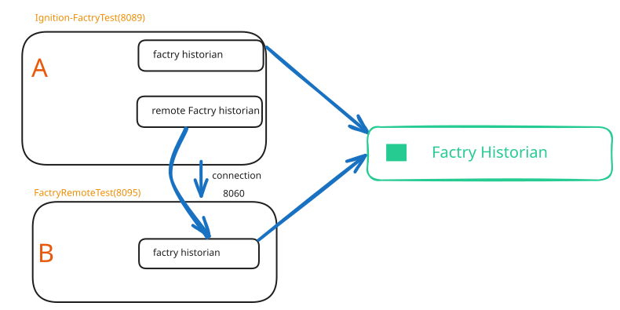

# Manual Test Plan

## Prerequisites

- **Docker environment running** (`docker compose up -d`) with all containers healthy
- **Module installed** and active in **Config > System > Modules**
- **Factry setup wizard completed** at http://localhost:8000
- **Time series database created** in Factry (Configuration > Time Series Databases)
- **Historian profile** created in **Config > Tags > History > Historians**:
- **Factry Historian** — the module automatically creates an S&F engine on startup

The historian profile should show **Running** status in the Historians list.

---

## Overview of the test environment

## Group 1: Tag Creation and Metadata

These tests use the Tag Browser in the Designer (**Config > Tags > Tag Browser**).
Open your designer and create tags with historian and parameters:

- [+] T1.1 — name=`ManualTest/ff1`, type=float, write values 10.0, 20.0, 30.0, etc.
- [+] T1.2 — name=`ManualTest/bb1`, type=Boolean, toggle a few times
- [+] T1.3 — name=`ManualTest/ss1`, type=String, write "hello", "world"
- [+] T1.4 — name=`ManualTest/ii1`, type=Int4, write 1, 2, 3
- [+] T1.5 — name=`ManualTest/Subfolder/Deep`, type=Float8, verify full path in Factry
- [+] T1.6 — Rename `ManualTest/ff1` → `ManualTest/ff1Renamed`, write new value, verify new measurement created (old stays there)
- [+] T1.7 — Move `ManualTest/bb1` into `ManualTest/Subfolder/`, write new value, verify new measurement
- [+] T1.8 — Write a value, check Status > Store & Forward, verify data flows through S&F engine
- [+] T1.9 — Disable history on a tag, write values (should NOT appear), re-enable, write again (should appear)

---

- [-] T1.11 - Create a calculation in Factry WebUI (remark: Test button broken, reported to Factry)
- [ ] T1.12 - Create assets in Factry WebUI

Check the results in Factry Measurements and on PowerChart. Check if the store & forward shows statistics. 

## Group 2: Store and Forward

- [ ] T2.0 - check if there is a store and forward engine
- [ ] T2.1 — Factry goes down (`docker compose stop historian`) — data buffered, pending count increases, historian status shows error
- [ ] T2.2 — Factry comes back (`docker compose start historian`) — data arrives to Factry, historian status shows active (~30 seconds), verify no data loss
  
## Group 3: Remote historian
  
- [ ] T3.1 — Create tags using remote historian, check if the data arrives
- [ ] T3.2 — Plot the results to a PowerChart

## Group: 4 Designer
- [ ] T4.1 — Create a label and assign the value of the historian
- [ ] T4.2 —

### Group 5: Use external datasource 
- [+] T5.1 — use realfakedata, see [realfakedata](fakedata.md)

