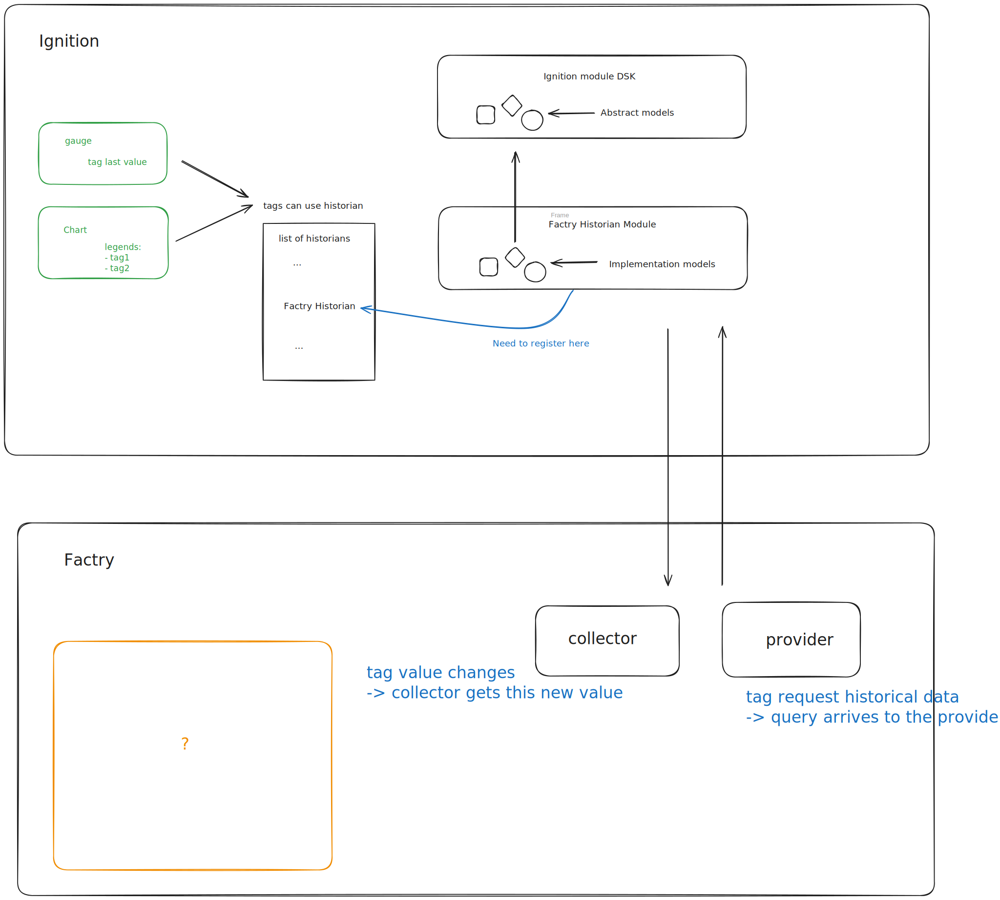
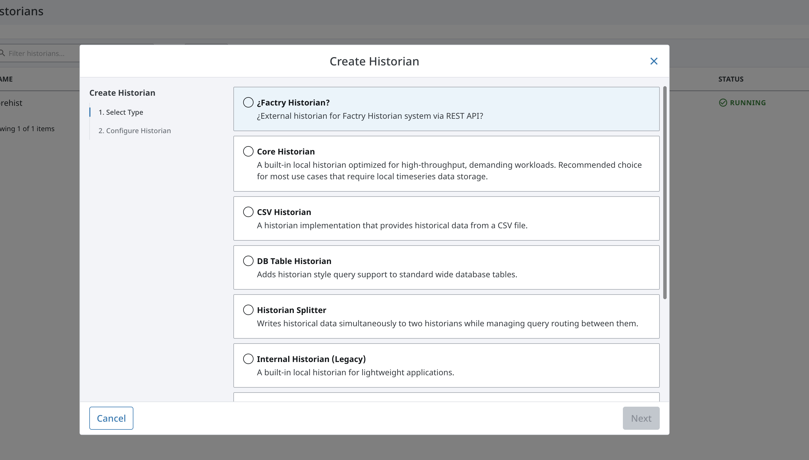
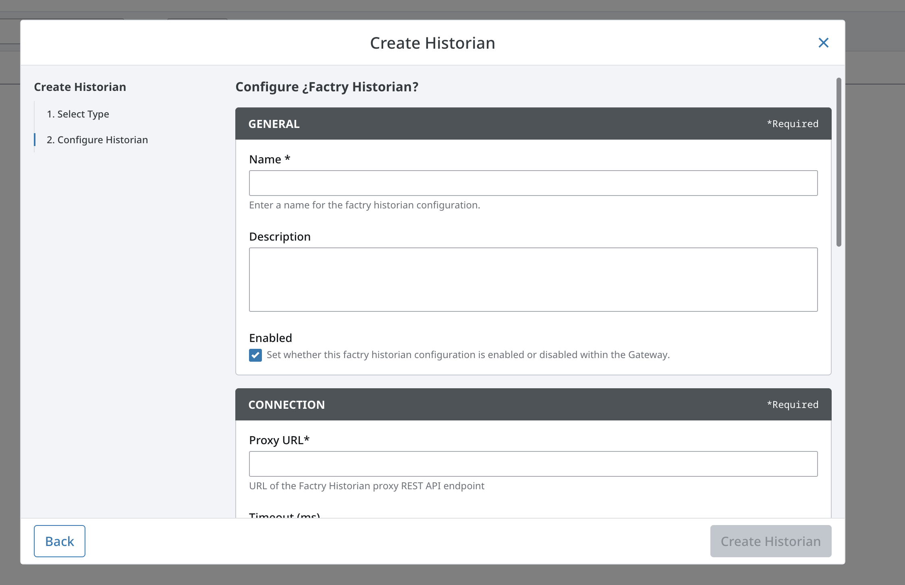

# Report 04.11.2025

This is a report after 4 days of research on ignition module development in Ignition 8.3.

# Context

We are developing a custom Historian module for Ignition 8.3 that integrates with Factry's external historian system via REST API.

The module implements both data collection (Storage Provider) and historical data querying (History Provider) to enable tag history functionality in Ignition. 

The proof of concept aims to demonstrate end-to-end functionality: storing tag data to Factry via a Golang proxy server and querying historical data for display in PowerChart. 

The module targets Ignition 8.3+ exclusively, using the new Historian Extension Point API introduced in version 8.3. 
Development is done using Ignition SDK 8.3.1 with Java 11, deployed via Docker for testing.

# Overview

explanations:
  - components on the ui are connected to tags
  - tags can have a value, type, state, etc... and historical value
  - tags can be read and write 
      read: creates a query and sends to the provider
      write: its value changes and this will be sent to the collector 
  - tags can be connected to historian
  - custom historian should be registered
  - custom historian is based on inheriting from abstract historian classes 
     from `com.inductiveautomation.historian`
     This is a new API, documentation is missing, good example is missing. 
  - the implementation should be able to send messages to the external provider and collector    

> Main difficulty:  missing documentation, but easy to get help on forum

# Factry module v0.1 progress and difficulties

## Successfully Implemented
- **Module Structure**: Multi-scope module (Gateway, Client, Designer, Common) building and signing correctly
- **Extension Point Registration**: HistorianExtensionPoint successfully registers Factry Historian in Gateway UI dropdown

- **Configuration UI**: Web-based configuration form with Connection and Advanced settings (URL, timeout, batch settings, debug logging)

- **Core Components**: FactryHistoryProvider, FactryQueryEngine, and FactryStorageEngine implemented with proper lifecycle management
- **HTTP Client**: FactryHttpClient configured for REST API communication with configurable timeout and error handling

## Current situation
 - Configuration of Factry Historian is half-ready. 
 - If the Factry Historian is registered, we can test the communication with mock provider/collector
 - After we can modify the communication to comply with Factry API

