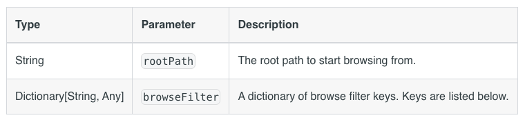
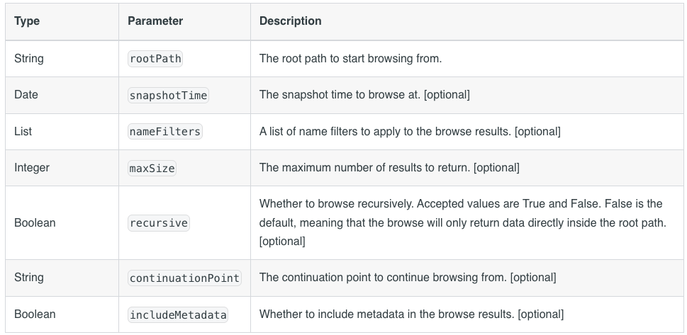
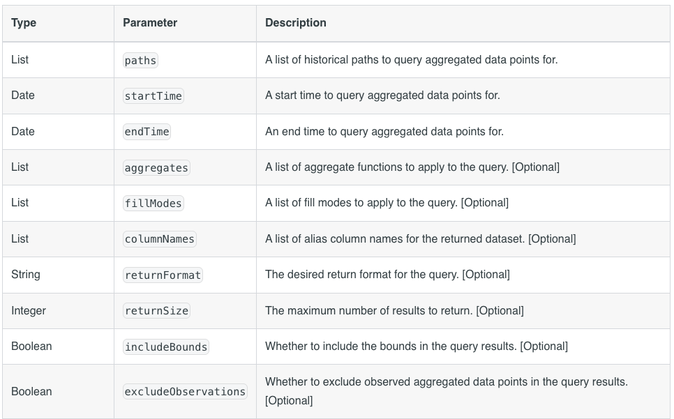
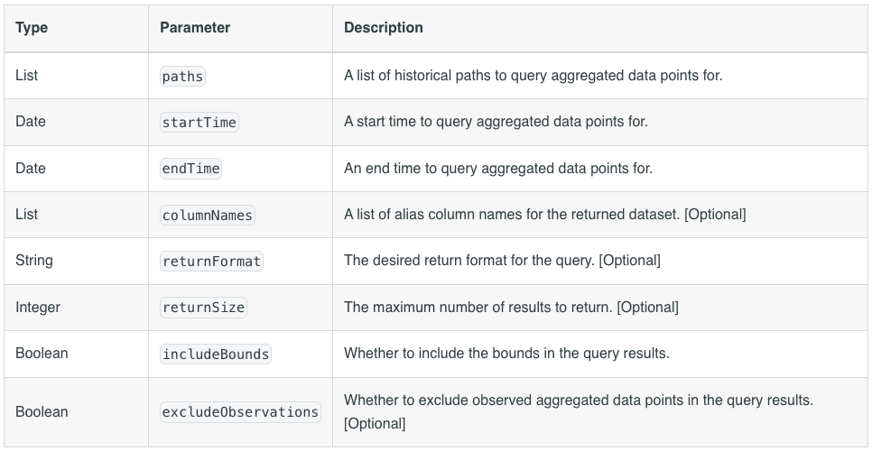
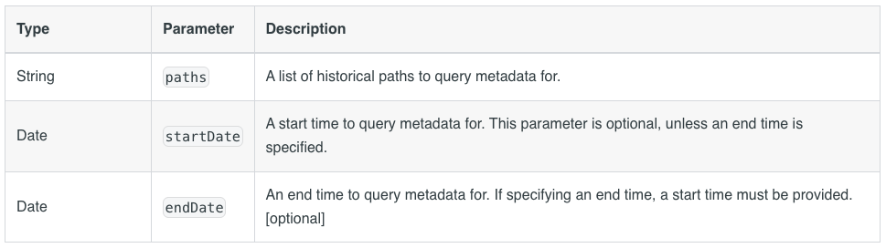
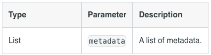
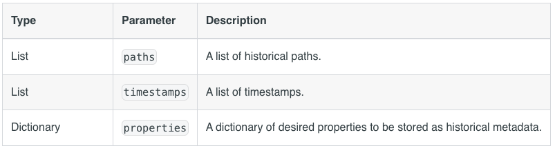
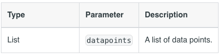
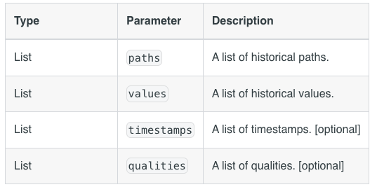

# Specification

This document is based on five days of research into the Ignition 8.3 Historian API and Factry system integration.

# Overview: Ignition Historian Module

## Ignition Platform
Ignition is an industrial automation platform for SCADA, IIoT, MES, and more from Inductive Automation. Version 8.3, released in August 2024, is the latest major release. Ignition is written in Java and Kotlin, with version 8.3 requiring Java 17. The platform uses Gradle as its official build tool and package manager.

Documentation is auto-generated from JavaDoc, but Kotlin components are not fully documented. Combined with limited examples for the new 8.3 APIs, this creates challenges for module development. The official Inductive Automation forum provides active support from experts to fill these gaps.

## Historian Concept
In industrial automation, a historian is a software component that continuously collects, stores, and serves time-series data from industrial sources (such as PLC tags and devices) for querying, trending, and analysis.

Ignition provides an abstract Historian API and SDK for both internal use and third-party historian integration through custom modules.

## Ignition 8.3 Historian API
Version 8.3 introduced a major refactoring of the Historian API. While the core changes are complete, documentation and examples are still limited. The public API is primarily contained in two packages:
  - `com.inductiveautomation.historian.gateway.api`
  - `com.inductiveautomation.historian.common.model`

### API Structure
```
com.inductiveautomation.historian.gateway.api
├── Historian<S>                    - Main historian interface
├── AbstractHistorian<S>            - Base implementation class
├── HistorianManager                - System historian manager
├── config/
│   └── HistorianSettings          - Configuration marker interface
├── query/
│   ├── QueryEngine                - Data retrieval interface
│   ├── AbstractQueryEngine        - Base query implementation
│   ├── browsing/
│   │   └── BrowsePublisher        - Tag browsing API
│   └── processor/
│       ├── RawPointProcessor      - Raw data processing
│       ├── AggregatedPointProcessor - Aggregated data processing
│       └── ComplexPointProcessor  - Complex data processing
├── storage/
│   ├── StorageEngine              - Data storage interface
│   └── AbstractStorageEngine      - Base storage implementation
└── paths/
    └── QualifiedPathAdapter       - Path normalization
```
Ignition modules uses OOP logic: implementation of the new historian connecection is based on inheriting and overwriting the abstract classes.


### Ignition Modules Folder Structure 

We use GCD scope, which means the code is available in all contexts:
- **G** (Gateway): Server-side code running on the Ignition Gateway
- **C** (Client): Code for Vision Clients and Designer environment
- **D** (Designer): Designer-only functionality


The Factry Historian module follows Ignition's GCD-scope architecture:

```
factry-historian-module/
├── common/              - Shared code (GCD scope: Gateway, Client, Designer)
│   └── src/            - Module constants and shared interfaces
├── gateway/            - Server-side historian logic (G scope: Gateway)
│   └── src/            - Storage Provider and History Provider implementations
├── client/             - Client runtime code (CD scope: Client, Designer)
│   └── src/            - Vision Client functionality
├── designer/           - Designer-specific code (D scope: Designer)
│   └── src/            - Designer tools and UI components
├── certificates/       - Module signing certificates (*.jks, *.p7b)
├── build/              - Gradle build output
│   └── Factry-Historian.modl  - Final signed module file
├── gradle/             - Gradle wrapper files
├── ignition/           - Docker development environment data (git-ignored)
├── proxy/              - Development proxy server
└── docs/               - Project documentation
```


## Tags in Ignition

Tags are named data points that represent real-time values from industrial sources (PLCs, sensors, OPC servers) or calculated values, serving as the fundamental abstraction for accessing, storing, and scripting against process data throughout the Ignition platform.

In historian all tags are listed in the tag browser per tag providers.


Beside the value, the tags have a lot of othere propperties like metadata( Engineering unit, format string), quality (is there active connection to the tag provider, isn't it obsolate), etc.

One property is the History: The factry historian should be connected at this point to the tag. 


All this properties can be changeged in the tag editor and this is where we can assign the historan property to Factry Historian.


The next picture explains the logic how the tag sends and recieve the data. 


Let's suppose a tag provider changes the value of a tag. Through the inherited and implemented Factry classes in the Factry module the appropriate method is invoked. In our implementation we send the new datapoint information to the Factry collector (either it is a proxy collector or direct Factry Historian).

When we add the tag to a chart, another method is invoked. This is responsible to form a query and this query will be sent to Factry Historian. The recieved data will be plotted on the chart. 

## Communication Protocol
The module communicates with external Factry services using gRPC, a high-performance RPC framework. Protocol Buffer (protobuf) definitions are shared between the Factry system and the Ignition module to generate type-safe Java objects for bi-directional communication.

## Use Factry Collector
The Factry Collector provides advanced features such as data compression and buffering that can be leveraged by the historian module. Therefore we plan to make it possible to use that as well as a proxy component between Ignition and Factry Historian


**Note:** The Factry Provider component is not yet implemented, and the Collector may not have all planned features available. 


## Ignition Python functions

This chapter elaborates the function which can be used in Ignition scripts.

## Historian Function

The list below demostrates the functions in Ignition. 

Decision is made to implement 6 features (the covered elements are outscope from this version)


1. browse: Returns a list of browse results for the specified Historian.
```
# Syntax #1
system.historian.browse(rootPath, BrowseFilter)
```
Parameters:



Filter Keys
The following keys represent filter criteria that can be used by the browseFilter parameter.

dataType: Represents the data type on the tag. Valid values can be found on the Tag Properties page.

valueSource: Represents how the node derives its value. Generally only used by nodes with a tag type of "AtomicTag".

tagType: The type of the node (tag, folder, UDT instance, etc). A list of possible types can be found on the Tag Properties page.

typeId: Represents the UDT type of the node. If the node is a UDT definition, then the value will be None. If the node is not a UDT, then this filter choice will not remove the element. As such, this filter functions best when paired with a tagType filter with a value of UdtInstance.

quality: Represents the "Bad" and "Good" quality on the node. All other quality codes are ignored.

maxResults: Limits the amount of results that will be returned by the function.

```python
# Syntax #2
system.historian.browse(rootPath[, snapshotTime][, nameFilters][, maxSize][, recursive][, continuationPoint][, includeMetadata]
```




1. queryAggregatedPoints: Queries aggregated data points for the specified historian.
```python
system.historian.queryAggregatedPoints(paths, startTime, endTime, [aggregates], [fillModes], [columnNames], [returnFormat], [returnSize], [includeBounds], [excludeObservations])
```
Parameters:



1. queryRawPoints Queries raw data points for the specified historian.

Syntax:
```python
system.historian.queryRawPoints(paths, startTime, endTime, [columnNames], [returnFormat], [returnSize], includeBounds, [excludeObservations])
```

Parameters:



Code example
```python
# Query a specified historical simulator tag path and display raw data from within the past minute

end = system.date.now()
start = system.date.addMinutes(end, -1)

myDataset = system.historian.queryRawPoints(["[default]_Simulator_/Random/RandomInteger1"], start, end, includeBounds=False)

for row in myDataset:
    print row[0], row[1]
```

4. queryMetadata: Queries metadata for the specified Historian.
```python
system.historian.queryMetadata(paths[, startDate][, endDate])
```


1. storeMetadata 

# syntax 2
```python
system.historian.storeMetadata(metadata)
```   
Parameters:



```python
# syntax 2
system.historian.storeMetadata(paths, timestamps, properties)
```



1. storeDataPoints   

```python
# syntax 1
system.historian.storeDataPoints(datapoints)
```
Parameters



```python
# syntax 2
system.historian.storeDataPoints(paths, values[, timestamps][, qualities])
```
Parameters




```python
## DataPoint can be imported and used for constructing

datapoint = DataPoint("histprov:test:/sys:myGateway:/prov:default:/tag:me", 42, system.date.now(), 192) 

system.historian.storeDataPoints([datapoint])

```

Ignition screenshots with explanations


## Implementation 

# Milestones:
1. Demo  
  
  
  Factry modules sends the new datapoints to the Factry Historian directly

1. Historian Collector
  Full implementation of the Factry modules collector part as described here. 
1. Historian Provider
   Full implementation of the Factry modules provider part as described here. 
   


# Appendix


## Links
System historian fucntions:
https://docs.inductiveautomation.com/docs/8.3/appendix/scripting-functions/system-historian

Custom historian forum
https://forum.inductiveautomation.com/t/ignition-8-3-building-a-custom-tag-historian-module/100725


