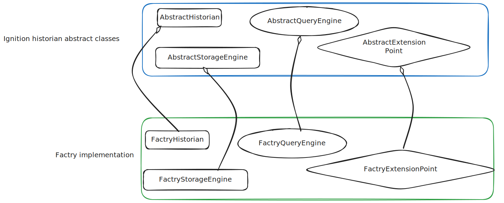
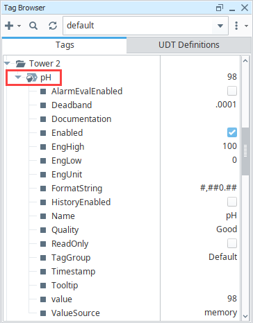
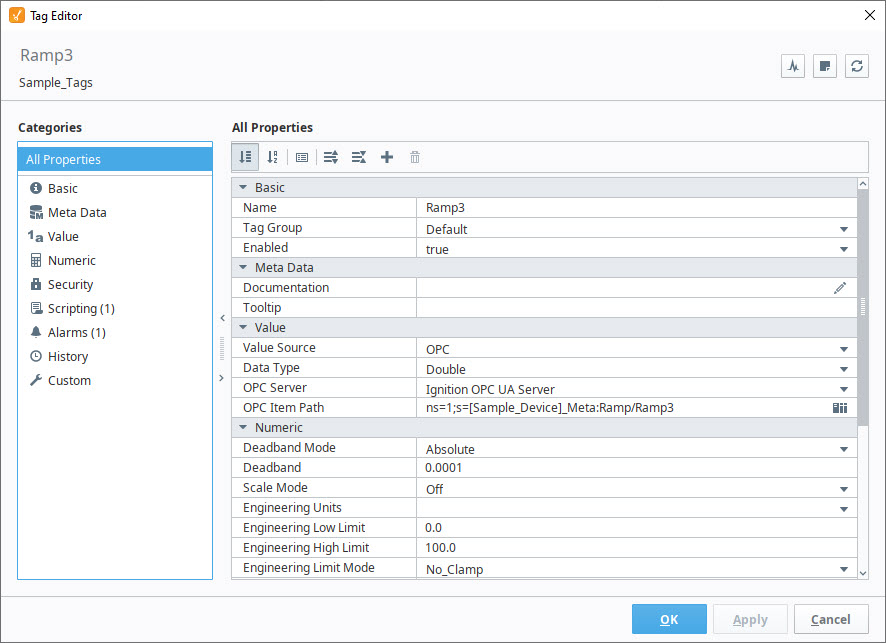
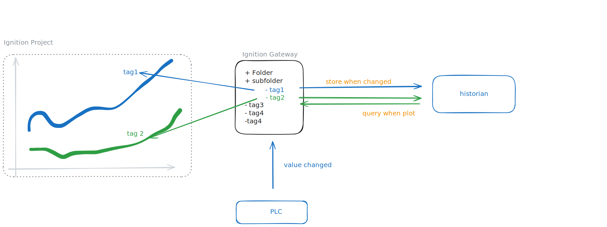
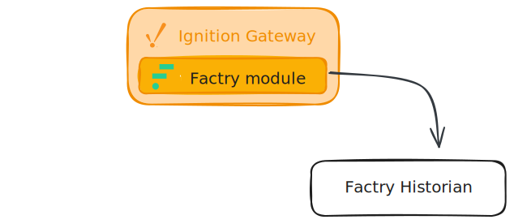

<div class="cover-page">
  <div class="cover-center">
    
    <h1 class="cover-title">Factry Historian Module<br/>Specification</h1>
  </div>
</div>

<br/>
# Specification

This document is based on five days of research into the Ignition 8.3 Historian API and Factry system integration.

# Overview: Ignition Historian Module

## Ignition Platform
Ignition is an industrial automation platform for SCADA, IIoT, MES, and more from Inductive Automation. Version 8.3, released in August 2024, is the latest major release. Ignition is written in Java and Kotlin, with version 8.3 requiring Java 17. The platform uses Gradle as its official build tool and package manager.

Documentation is auto-generated from JavaDoc, but Kotlin components are not fully documented. Combined with limited examples for the new 8.3 APIs, this creates challenges for module development. The official Inductive Automation forum provides active support from experts to fill these gaps.

## Historian Concept
In industrial automation, a historian is a software component that continuously collects, stores, and serves time-series data from industrial sources (such as PLC tags and devices) for querying, trending, and analysis.

Ignition provides an abstract Historian API and SDK for both internal use and third-party historian integration through custom modules.

## Ignition 8.3 Historian API
Version 8.3 introduced a major refactoring of the Historian API. While the core changes are complete, documentation and examples are still limited. The public API is primarily contained in two packages:
  - `com.inductiveautomation.historian.gateway.api`
  - `com.inductiveautomation.historian.common.model`

### API Structure
```
com.inductiveautomation.historian.gateway.api
├── Historian<S>                    - Main historian interface
├── AbstractHistorian<S>            - Base implementation class
├── HistorianManager                - System historian manager
├── config/
│   └── HistorianSettings          - Configuration marker interface
├── query/
│   ├── QueryEngine                - Data retrieval interface
│   ├── AbstractQueryEngine        - Base query implementation
│   ├── browsing/
│   │   └── BrowsePublisher        - Tag browsing API
│   └── processor/
│       ├── RawPointProcessor      - Raw data processing
│       ├── AggregatedPointProcessor - Aggregated data processing
│       └── ComplexPointProcessor  - Complex data processing
├── storage/
│   ├── StorageEngine              - Data storage interface
│   └── AbstractStorageEngine      - Base storage implementation
└── paths/
    └── QualifiedPathAdapter       - Path normalization
```
Ignition modules uses OOP logic: implementation of the new historian connecection is based on inheriting and overwriting the abstract classes.




### Ignition Modules Folder Structure 

We use GCD scope, which means the code is available in all contexts:
- **G** (Gateway): Server-side code running on the Ignition Gateway
- **C** (Client): Code for Vision Clients and Designer environment
- **D** (Designer): Designer-only functionality


The Factry Historian module follows Ignition's GCD-scope architecture:

```
factry-historian-module/
├── common/              - Shared code (GCD scope: Gateway, Client, Designer)
│   └── src/            - Module constants and shared interfaces
├── gateway/            - Server-side historian logic (G scope: Gateway)
│   └── src/            - Storage Provider and History Provider implementations
├── client/             - Client runtime code (CD scope: Client, Designer)
│   └── src/            - Vision Client functionality
├── designer/           - Designer-specific code (D scope: Designer)
│   └── src/            - Designer tools and UI components
├── certificates/       - Module signing certificates (*.jks, *.p7b)
├── build/              - Gradle build output
│   └── Factry-Historian.modl  - Final signed module file
├── gradle/             - Gradle wrapper files
├── ignition/           - Docker development environment data (git-ignored)
├── proxy/              - Development proxy server
└── docs/               - Project documentation
```


## Tags in Ignition

Tags are named data points that represent real-time values from industrial sources (PLCs, sensors, OPC servers) or calculated values, serving as the fundamental abstraction for accessing, storing, and scripting against process data throughout the Ignition platform.

The Tag Browser displays all tags organized by tag provider:



Beyond the current value, each tag has additional properties:
- **Metadata**: Engineering units, format string, documentation
- **Quality**: Connection status, staleness indicators
- **History**: Configuration for historical data storage

The History property is where the Factry Historian connects to a tag. All tag properties can be configured in the Tag Editor, including assigning Factry Historian as the history provider:



### Data Flow

The following diagram illustrates how tags send and receive historical data:



**Writing data (Storage):** When a tag provider updates a tag value, the Factry module's storage engine is invoked. Our implementation forwards the new data point to the Factry Collector (either as a proxy or directly to Factry Historian).

**Reading data (Query):** When a tag is added to a chart or trend, the Factry module's query engine is invoked. It constructs and sends a query to Factry Historian, then returns the retrieved data for visualization. 

## Communication Protocol

The module communicates with Factry services using gRPC, a high-performance RPC framework designed for low-latency, high-throughput communication.

**Protocol Buffers (protobuf)** define the message formats and service interfaces shared between Factry and the Ignition module. These definitions generate type-safe Java classes for:
- Data point transmission (timestamps, values, quality codes)
- Query requests and responses
- Configuration and metadata exchange

This approach ensures consistent serialization, backward compatibility, and efficient binary encoding for industrial data volumes.

## Factry Collector Integration

The Factry Collector can serve as an intermediary between Ignition and Factry Historian, providing:
- **Data buffering**: Store-and-forward capability during network outages
- **Compression**: Reduce bandwidth usage for high-frequency data
- **Local aggregation**: Pre-process data before transmission


The module supports two deployment modes:
1. **Direct mode**: Ignition communicates directly with Factry Historian
2. **Collector mode**: Ignition sends data through the Factry Collector proxy

**Note:** The Factry Provider component is not yet implemented, and the Collector may not have all planned features available. 


# Ignition Python Functions

With proper implementation of the historian module, the historian functionality is available from Ignition's Python scripting environment. This chapter documents the available functions.

## Supported Functions

The Factry Historian module implements 6 of the available historian functions. Functions marked as out of scope are not implemented in this version.


### 1. browse

Returns a list of browse results for the specified historian.

**Syntax 1:**
```python
system.historian.browse(rootPath, browseFilter)
```

Parameters:
- `rootPath` (String): The root path to start browsing from.
- `browseFilter` (Dictionary[String, Any]): A dictionary of browse filter keys. Keys are listed below.

**Filter Keys:**
- `dataType`: Represents the data type on the tag. Valid values can be found on the Tag Properties page.
- `valueSource`: Represents how the node derives its value. Generally only used by nodes with a tag type of "AtomicTag".
- `tagType`: The type of the node (tag, folder, UDT instance, etc). A list of possible types can be found on the Tag Properties page.
- `typeId`: Represents the UDT type of the node. If the node is a UDT definition, then the value will be None. If the node is not a UDT, then this filter choice will not remove the element. Functions best when paired with a tagType filter with a value of UdtInstance.
- `quality`: Represents the "Bad" and "Good" quality on the node. All other quality codes are ignored.
- `maxResults`: Limits the amount of results that will be returned by the function.

**Syntax 2:**
```python
system.historian.browse(rootPath[, snapshotTime][, nameFilters][, maxSize][, recursive][, continuationPoint][, includeMetadata])
```

Parameters:
- `rootPath` (String): The root path to start browsing from.
- `snapshotTime` (Date): The snapshot time to browse at. [optional]
- `nameFilters` (List): A list of name filters to apply to the browse results. [optional]
- `maxSize` (Integer): The maximum number of results to return. [optional]
- `recursive` (Boolean): Whether to browse recursively. Accepted values are True and False. False is the default, meaning that the browse will only return data directly inside the root path. [optional]
- `continuationPoint` (String): The continuation point to continue browsing from. [optional]
- `includeMetadata` (Boolean): Whether to include metadata in the browse results. [optional]

### 2. queryAggregatedPoints

Queries aggregated data points for the specified historian.

```python
system.historian.queryAggregatedPoints(paths, startTime, endTime[, aggregates][, fillModes][, columnNames][, returnFormat][, returnSize][, includeBounds][, excludeObservations])
```

Parameters:
- `paths` (List): A list of historical paths to query aggregated data points for.
- `startTime` (Date): A start time to query aggregated data points for.
- `endTime` (Date): An end time to query aggregated data points for.
- `aggregates` (List): A list of aggregate functions to apply to the query. [optional]
- `fillModes` (List): A list of fill modes to apply to the query. [optional]
- `columnNames` (List): A list of alias column names for the returned dataset. [optional]
- `returnFormat` (String): The desired return format for the query. [optional]
- `returnSize` (Integer): The maximum number of results to return. [optional]
- `includeBounds` (Boolean): Whether to include the bounds in the query results. [optional]
- `excludeObservations` (Boolean): Whether to exclude observed aggregated data points in the query results. [optional]

### 3. queryRawPoints

Queries raw data points for the specified historian.

```python
system.historian.queryRawPoints(paths, startTime, endTime[, columnNames][, returnFormat][, returnSize], includeBounds[, excludeObservations])
```

Parameters:
- `paths` (List): A list of historical paths to query aggregated data points for.
- `startTime` (Date): A start time to query aggregated data points for.
- `endTime` (Date): An end time to query aggregated data points for.
- `columnNames` (List): A list of alias column names for the returned dataset. [optional]
- `returnFormat` (String): The desired return format for the query. [optional]
- `returnSize` (Integer): The maximum number of results to return. [optional]
- `includeBounds` (Boolean): Whether to include the bounds in the query results.
- `excludeObservations` (Boolean): Whether to exclude observed aggregated data points in the query results. [optional]

**Example:**
```python
# Query a historical tag path and display raw data from the past minute
end = system.date.now()
start = system.date.addMinutes(end, -1)

myDataset = system.historian.queryRawPoints(
    ["[default]_Simulator_/Random/RandomInteger1"],
    start,
    end,
    includeBounds=False
)

for row in myDataset:
    print row[0], row[1]
```

### 4. queryMetadata

Queries metadata for the specified historian.

```python
system.historian.queryMetadata(paths[, startDate][, endDate])
```

Parameters:
- `paths` (String): A list of historical paths to query metadata for.
- `startDate` (Date): A start time to query metadata for. This parameter is optional, unless an end time is specified.
- `endDate` (Date): An end time to query metadata for. If specifying an end time, a start time must be provided. [optional]

### 5. storeMetadata

Stores metadata for the specified historian.

**Syntax 1:**
```python
system.historian.storeMetadata(metadata)
```

Parameters:
- `metadata` (List): A list of metadata.

**Syntax 2:**
```python
system.historian.storeMetadata(paths, timestamps, properties)
```

Parameters:
- `paths` (List): A list of historical paths.
- `timestamps` (List): A list of timestamps.
- `properties` (Dictionary): A dictionary of desired properties to be stored as historical metadata.

### 6. storeDataPoints

Stores data points to the specified historian.

**Syntax 1:**
```python
system.historian.storeDataPoints(datapoints)
```

Parameters:
- `datapoints` (List): A list of data points.

**Syntax 2:**
```python
system.historian.storeDataPoints(paths, values[, timestamps][, qualities])
```

Parameters:
- `paths` (List): A list of historical paths.
- `values` (List): A list of historical values.
- `timestamps` (List): A list of timestamps. [optional]
- `qualities` (List): A list of qualities. [optional]

**Example using DataPoint:**
```python
from com.inductiveautomation.historian.common.model import DataPoint

datapoint = DataPoint(
    "histprov:test:/sys:myGateway:/prov:default:/tag:me",
    42,
    system.date.now(),
    192
)

system.historian.storeDataPoints([datapoint])
```


## Implementation 

# Milestones:
1. Demo  
  
  
  Factry modules sends the new datapoints to the Factry Historian directly

1. Historian Collector
  Full implementation of the Factry modules collector part as described here. 
1. Historian Provider
   Full implementation of the Factry modules provider part as described here. 
   


# Appendix


## Links
System historian fucntions:
https://docs.inductiveautomation.com/docs/8.3/appendix/scripting-functions/system-historian

Custom historian forum
https://forum.inductiveautomation.com/t/ignition-8-3-building-a-custom-tag-historian-module/100725


